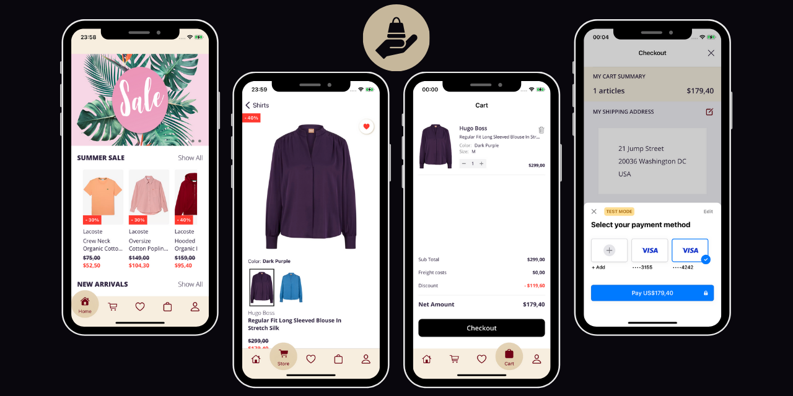

<div align="center">


# eCommerce — Premium Fashion Store for iOS

<br/>

[](https://swift.org)
[](https://developer.apple.com/swiftui/)
[](https://developer.apple.com/ios/)
[](https://firebase.google.com/)
[](https://stripe.com/)
[](https://developer.apple.com/xcode/)
[](LICENSE)

<br/>

A **production-ready**, full-featured iOS eCommerce application built entirely with **SwiftUI**.
Browse premium fashion brands, manage favorites, handle secure payments via **Stripe**, and track orders — all powered by a real-time **Firebase** backend with clean **MVVM + Repository** architecture.

<br/>



<br/>

**12+ Premium Brands** · **140+ Products** · **Real-time Sync** · **Secure Payments** · **Universal Links**

<br/>

[Features](#-features) · [Architecture](#-architecture) · [Screens](#-app-screens) · [Getting Started](#-getting-started) · [Tech Stack](#-tech-stack) · [Author](#-author)

</div>

<br/>

---

<br/>

## Features

<table>
<tr>
<td width="50%">

### Shopping Experience
- Browse **140+ products** across **12 premium brands**
- Filter by **categories** — Clothing, Shoes, Accessories
- **30+ subcategories** — Dresses, Trainers, Bags, Watches...
- Filter by **gender** — Women, Men, Kids
- **Infinite scroll** pagination for smooth browsing
- Product **color variants** with image switching
- **Size selection** with available sizes per product
- **Discount tags** and **New Arrival** badges
- Expandable product **descriptions**

</td>
<td width="50%">

### User & Account
- **Email/password** authentication with Firebase
- **Profile management** — name, phone, email
- **Shipping address** — add, edit, remove
- **Email update** with verification via Universal Links
- **Password change** with reauthentication
- **Account deletion** with confirmation flow
- **Order history** with full detail breakdowns
- **Real-time** data sync across all screens

</td>
</tr>
<tr>
<td width="50%">

### Cart & Checkout
- **Add to cart** with size, color, quantity selection
- **Quantity controls** — increase, decrease, remove
- **Live cart totals** — subtotal, freight, discounts
- **Stripe PaymentSheet** — secure, PCI-compliant checkout
- **Shipping address** validation before payment
- **Order confirmation** with order ID
- **Automatic cart clearing** after successful payment

</td>
<td width="50%">

### Technical Highlights
- **Repository Design Pattern** with protocol abstraction
- **MVVM** architecture with Combine bindings
- **Firebase Remote Config** for dynamic color theming
- **Firebase Analytics** — 10+ custom events tracked
- **Deep Linking** via Universal Links (AASA)
- **Firestore real-time listeners** via Combine publishers
- **Custom OpenSans** typography (5 font weights)
- **Spring animations** on tab bar transitions

</td>
</tr>
</table>

<br/>

---

<br/>

## Architecture

The project implements a **layered architecture** combining **MVVM** with the **Repository Design Pattern**, ensuring clean separation of concerns, testability, and scalability.

```
┌──────────────────────────────────────────────────────────────────────┐
│                                                                      │
│   ┌────────────────────────────────────────────────────────────┐     │
│   │                    PRESENTATION LAYER                      │     │
│   │                                                            │     │
│   │   Views (SwiftUI)          ViewModels (ObservableObject)   │     │
│   │   ┌──────────────┐        ┌──────────────────────┐        │     │
│   │   │  HomeView     │◄──────│  HomeViewModel        │        │     │
│   │   │  StoreView    │◄──────│  ProductsViewModel    │        │     │
│   │   │  CartView     │◄──────│  CartViewModel        │        │     │
│   │   │  FavoritesView│◄──────│  FavoriteProductsVM   │        │     │
│   │   │  ProfileView  │◄──────│  ProfileViewModel     │        │     │
│   │   │  CheckoutView │◄──────│  CheckoutViewModel    │        │     │
│   │   └──────────────┘        └──────────┬───────────┘        │     │
│   └──────────────────────────────────────┼─────────────────────┘     │
│                                          │                           │
│   ┌──────────────────────────────────────┼─────────────────────┐     │
│   │                    DOMAIN LAYER      │                     │     │
│   │                                      ▼                     │     │
│   │   ┌──────────────────────────────────────────────────┐     │     │
│   │   │            Repository Protocols                  │     │     │
│   │   │  UserRepository · ProductRepository              │     │     │
│   │   │  CartRepository · OrderRepository                │     │     │
│   │   │  FavoriteProductRepository                       │     │     │
│   │   │  DiscountProductRepository · NewInProductRepo    │     │     │
│   │   └──────────────────────┬───────────────────────────┘     │     │
│   └──────────────────────────┼─────────────────────────────────┘     │
│                              │                                       │
│   ┌──────────────────────────┼─────────────────────────────────┐     │
│   │                  DATA LAYER          │                     │     │
│   │                              ▼                             │     │
│   │   ┌────────────────┐  ┌────────────────┐  ┌────────────┐  │     │
│   │   │ Authentication │  │  UserManager   │  │  Product    │  │     │
│   │   │ Manager        │  │  + Cart        │  │  Manager    │  │     │
│   │   │                │  │  + Favorites   │  │  + Discount │  │     │
│   │   │  Firebase Auth │  │  + Orders      │  │  + NewIn    │  │     │
│   │   └───────┬────────┘  └───────┬────────┘  └──────┬─────┘  │     │
│   │           │                   │                   │        │     │
│   │   ┌───────┴───────┐  ┌───────┴────────┐  ┌──────┴─────┐  │     │
│   │   │ PaymentManager│  │ DeepLinkManager│  │BackendAPI  │  │     │
│   │   │  Stripe SDK   │  │ Universal Links│  │ Alamofire  │  │     │
│   │   └───────────────┘  └────────────────┘  └────────────┘  │     │
│   └────────────────────────────────────────────────────────────┘     │
│                                                                      │
│   ┌────────────────────────────────────────────────────────────┐     │
│   │                  EXTERNAL SERVICES                         │     │
│   │   Firebase Auth · Firestore · Storage · Analytics          │     │
│   │   Remote Config · Hosting · Stripe API · Render Backend    │     │
│   └────────────────────────────────────────────────────────────┘     │
│                                                                      │
└──────────────────────────────────────────────────────────────────────┘
```

### Design Principles

| Principle | Implementation |
|:---|:---|
| **Protocol-Driven Design** | 7 repository protocols abstract all data access — swap implementations without touching ViewModels |
| **MVVM with Combine** | 11 ViewModels bind to Views via `@Published` properties and Combine publishers |
| **Manager Pattern** | 5 dedicated service managers encapsulate Firebase, Stripe, and Deep Link logic |
| **Real-time Reactivity** | Firestore snapshot listeners push updates via Combine, keeping UI always in sync |
| **Single Responsibility** | Each manager handles one concern — `UserManager+Cart`, `UserManager+Order`, etc. |
| **Dependency Injection** | Managers injected as `@EnvironmentObject`, enabling clean testing and modularity |

<br/>

---

<br/>

## App Screens

### Authentication Flow

| Screen | Description |
|:---|:---|
| **Sign In** | Email & password login with inline validation. "Forgot Password" triggers a reset email via Firebase |
| **Sign Up** | Full registration — first name, last name, email, password. Automatically creates a Stripe Customer |
| **Reset Password** | Modal sheet to send password reset emails |

### Main Tab Navigation

The app uses a **custom animated tab bar** with 5 tabs, featuring spring animations and blur effects via `matchedGeometryEffect`:

<table>
<tr>
<td align="center" width="20%"><b>Home</b></td>
<td align="center" width="20%"><b>Store</b></td>
<td align="center" width="20%"><b>Favorites</b></td>
<td align="center" width="20%"><b>Cart</b></td>
<td align="center" width="20%"><b>Profile</b></td>
</tr>
<tr>
<td>Featured carousel, Summer Sale, New Arrivals</td>
<td>Category browsing, product grid, infinite scroll</td>
<td>Saved products with real-time sync</td>
<td>Cart items, quantities, totals, checkout</td>
<td>Personal info, orders, addresses, settings</td>
</tr>
</table>

### Home Screen
- **Feature Image Carousel** — `UIPageViewController` wrapper with custom `PageControl` dots
- **Summer Sale Section** — Horizontally scrollable discounted products
- **New Arrivals Section** — Latest products with "New In" badges
- Each product cell shows brand, name, price, discount strikethrough, and color variants

### Store & Product Detail
- **Master Categories** — Clothing, Shoes, Accessories (with category images)
- **Subcategories** — 30+ subcategories (Dresses, Trainers, Bags, Watches, etc.)
- **Product List** — Lazy-loaded grid with **infinite scroll** (10 items per page)
- **Product Detail** — Full-width image, color variant selector, size picker, quantity stepper, expandable description, add to cart/favorites

### Cart & Checkout
- **Cart View** — Item list with inline quantity controls (+/-), remove button, price breakdown
- **Empty State** — Custom illustration when cart is empty
- **Checkout View** — Cart summary, shipping address form, Stripe PaymentSheet, order confirmation with unique order ID

### Profile & Account Management
- **Personal Info** — Edit first name, last name, phone number
- **Email Update** — Sends verification link, handles deep link callback
- **Password Change** — Reauthentication required for security
- **Shipping Address** — Full address management (street, postal code, town, country)
- **Order History** — All past orders sorted by date, with item details and amount breakdowns
- **App Settings** — Dynamic color theme via Firebase Remote Config
- **Account Deletion** — Reauthentication + confirmation dialog
- **Sign Out** — Clean session teardown

<br/>

---

<br/>

## Data Models

```swift
// Core product model with variants and metadata
Product: id, name, price, brand, gender, category, subCategory,
         description, sizes, variants[color, colorName, imageUrl],
         isDiscounted, isNewIn

// Shopping cart with cost breakdown
Cart: id, cartItems[], freightCosts, discountAmount, totalAmount
CartItem: id, name, brand, size, price, discountPercent, quantity,
          colorName, imageUrl, dateAdded

// Complete order record
Order: id, userId, orderItems[], freightCosts, discountAmount,
       totalAmount, numberOfArticles, shippingAddress, dateCreated

// User profile with nested data
Profile: uid, email, firstName, lastName, phoneNumber, dateCreated,
         favoriteProducts[], cart, shippingAddress, paymentId

// Supporting models
ShippingAddress: id, streetNumber, streetName, postalCode, town, country
Discount: id, discountPercent
FavoriteProduct: id, productId, dateAdded
```

### Brands Catalog

| | | | |
|:---:|:---:|:---:|:---:|
| Lacoste | Ralph Lauren | Adidas | Hugo Boss |
| Diesel | Guess | Reebok | Tommy Hilfiger |
| Armani Exchange | Puma | Asics | Nike |

<br/>

---

<br/>

## Firebase Analytics Events

The app tracks comprehensive user engagement events:

| Event | Trigger | Parameters |
|:---|:---|:---|
| `sign_up` | User registers | method |
| `login` | User signs in | method |
| `view_item_list` | Category browsed | item_list_id, item_list_name |
| `view_item` | Product detail opened | item_id, item_name, price, brand, category |
| `add_to_wishlist` | Product favorited | item_id, item_name, price |
| `add_to_cart` | Product added to cart | item_id, item_name, price, quantity |
| `remove_from_cart` | Product removed from cart | item_id, item_name, price |
| `view_cart` | Cart screen opened | currency, value, items |
| `begin_checkout` | Checkout initiated | currency, value, items |
| `add_shipping_info` | Address entered | currency, value, shipping_tier |
| `purchase` | Payment completed | transaction_id, value, currency, items |

<br/>

---

<br/>

## Tech Stack

<table>
<tr>
<td align="center" width="25%">
<br/>
<br/>
<b>SwiftUI</b><br/>
<sub>Declarative UI Framework</sub><br/><br/>
</td>
<td align="center" width="25%">
<br/>
<br/>
<b>Swift 5.9</b><br/>
<sub>Programming Language</sub><br/><br/>
</td>
<td align="center" width="25%">
<br/>
<br/>
<b>Firebase</b><br/>
<sub>Backend-as-a-Service</sub><br/><br/>
</td>
<td align="center" width="25%">
<br/>
<br/>
<b>Stripe</b><br/>
<sub>Payment Processing</sub><br/><br/>
</td>
</tr>
</table>

| Layer | Technology | Purpose |
|:---|:---|:---|
| **UI** | SwiftUI + Combine | Declarative views with reactive data binding |
| **Language** | Swift 5.9 | Type-safe, protocol-oriented programming |
| **Auth** | Firebase Authentication | Email/password sign-in, email verification, account management |
| **Database** | Cloud Firestore | NoSQL document database with real-time listeners |
| **Storage** | Firebase Cloud Storage | Product image hosting and retrieval |
| **Analytics** | Firebase Analytics | User engagement tracking with 10+ custom events |
| **Config** | Firebase Remote Config | Dynamic color theming without app updates |
| **Hosting** | Firebase Hosting | Universal Links and AASA file serving |
| **Payments** | Stripe iOS SDK | PaymentSheet, PaymentIntent, Customer, Ephemeral Keys |
| **Networking** | Alamofire | HTTP client for backend API communication |
| **Backend** | Node.js on Render | Stripe Customer creation and PaymentIntent generation |
| **Typography** | OpenSans (5 weights) | Light, Regular, SemiBold, Bold, ExtraBold |
| **Architecture** | MVVM + Repository | Clean separation with 7 repository protocols |

<br/>

---

<br/>

## Project Structure

```
eCommerce/
│
├── eCommerceApp.swift                          # App entry point, Firebase init, Deep Link handling
├── ContentView.swift                           # Root navigation, auth state observer
│
├── Views/
│   ├── Authentication/
│   │   ├── SignInView.swift                    # Login screen with validation
│   │   ├── SignUpView.swift                    # Registration with Stripe customer creation
│   │   ├── ResetPasswordView.swift            # Password reset sheet
│   │   └── Subviews/
│   │       ├── CustomTextFieldView.swift       # Reusable text field with clear button
│   │       ├── CustomSecureFieldView.swift     # Password field with show/hide toggle
│   │       ├── ButtonView.swift                # Styled action button
│   │       ├── LogoView.swift                  # App logo component
│   │       └── BackgroundView.swift            # Gradient background
│   │
│   ├── TabBar/
│   │   ├── TabBarView.swift                    # Main 5-tab navigation
│   │   └── TabButton.swift                     # Animated tab button with blur effect
│   │
│   ├── Home/
│   │   ├── HomeView.swift                      # Featured products feed
│   │   └── Subviews/
│   │       ├── PageViewController.swift        # UIKit carousel wrapper
│   │       ├── PageView.swift                  # Individual carousel page
│   │       ├── PageControl.swift               # Dot pagination indicator
│   │       ├── PageFeatureImage.swift           # Feature banner image
│   │       └── FeaturedProductCellView.swift   # Horizontal product card
│   │
│   ├── Store/
│   │   ├── StoreView.swift                     # Master category grid
│   │   ├── CategoriesListView.swift            # Subcategory list
│   │   ├── ProductsListView.swift              # Paginated product grid
│   │   ├── ProductDetailView.swift             # Full product detail page
│   │   └── Subviews/
│   │       ├── CategoriesRowView.swift         # Category card with image
│   │       ├── ProductCellView.swift           # Product grid cell
│   │       ├── StoreRowView.swift              # Store list row
│   │       ├── ProductVariantsImageView.swift  # Color variant image selector
│   │       ├── ProductVariantsColorView.swift  # Color dot selector
│   │       ├── SelectSizeView.swift            # Size selection chips
│   │       ├── ProductPriceView.swift          # Price with discount display
│   │       ├── AddToCartButtonView.swift       # Add to cart action
│   │       ├── DiscountTagView.swift           # Red discount badge
│   │       └── NewInTagView.swift              # Black "New In" badge
│   │
│   ├── Favorites/
│   │   ├── FavoritesView.swift                 # Saved products list
│   │   └── Subviews/
│   │       └── ProductCellViewBuilder.swift    # Async product cell loader
│   │
│   ├── Cart/
│   │   ├── CartView.swift                      # Shopping cart with totals
│   │   ├── CheckoutView.swift                  # Payment & order flow
│   │   └── Subviews/
│   │       ├── CartItemRowView.swift           # Cart item with controls
│   │       ├── CartAmountView.swift            # Price breakdown display
│   │       ├── IncreaseQuantityButtonView.swift
│   │       ├── DecreaseQuantityButtonView.swift
│   │       ├── RemoveCartItemButtonView.swift
│   │       ├── CheckoutButtonView.swift        # Checkout trigger
│   │       ├── CheckoutCartSumaryView.swift    # Order summary
│   │       ├── CheckoutContinueButtonView.swift
│   │       ├── CheckoutPaymentButtonContentView.swift
│   │       └── OrderConfirmationView.swift     # Success screen with order ID
│   │
│   └── Profile/
│       ├── ProfileView.swift                   # User profile dashboard
│       ├── EditPersonalInfoView.swift          # Edit name, phone
│       ├── AddOrEditShippingAddressView.swift  # Address form
│       ├── OrderListView.swift                 # All orders list
│       ├── OrderDetailsView.swift              # Single order breakdown
│       ├── DeleteAccountView.swift             # Account deletion flow
│       └── Subviews/
│           ├── PersonalInfoView.swift          # Info display card
│           ├── ButtonEditPersonalInfoView.swift
│           ├── EditEmailView.swift             # Email update with verification
│           ├── EditPasswordView.swift          # Password change form
│           ├── ShippingAddressSectionView.swift
│           ├── OrdersSectionView.swift
│           ├── OrderCellView.swift             # Order list item
│           ├── OrderItemRowView.swift          # Order detail item
│           ├── OrderAmountView.swift           # Order cost breakdown
│           ├── OrderDetailPersonnalInfoSectionView.swift
│           ├── AppSettingsSectionView.swift     # Remote Config colors
│           ├── MenuButtonView.swift            # Profile menu item
│           ├── SignOutButtonView.swift
│           └── DeleteAccountSectionView.swift
│
├── ViewModels/
│   ├── SignInViewModel.swift                   # Login logic + analytics
│   ├── SignUpViewModel.swift                   # Registration + Stripe customer
│   ├── HomeViewModel.swift                     # Featured products loading
│   ├── ProductsViewModel.swift                 # Product listing + pagination
│   ├── AddToCartViewModel.swift                # Cart add logic + analytics
│   ├── AddToFavoriteViewModel.swift            # Favorites logic + listener
│   ├── CartViewModel.swift                     # Cart state + quantity management
│   ├── CheckoutViewModel.swift                 # Payment flow + order creation
│   ├── FavoriteProductsViewModel.swift         # Favorites list + real-time sync
│   ├── OrdersViewModel.swift                   # Order history loading
│   └── ProfileViewModel.swift                  # Profile CRUD + auth operations
│
├── Models/
│   ├── Product.swift                           # Product with variants, Codable
│   ├── Cart.swift                              # Cart with cost calculations
│   ├── CartItem.swift                          # Cart line item
│   ├── Order.swift                             # Completed order record
│   ├── OrderItem.swift                         # Order line item
│   ├── Profile.swift                           # User profile document
│   ├── ShippingAddress.swift                   # Address fields
│   ├── FavoriteProduct.swift                   # Favorite reference
│   ├── Discount.swift                          # Discount percentage
│   ├── NewIn.swift                             # New arrival marker
│   ├── Product Info/
│   │   ├── Gender.swift                        # Women, Men, Kids enum
│   │   ├── Category.swift                      # MasterCategory + SubCategory
│   │   └── Brand.swift                         # 12 fashion brands enum
│   └── StripeModels/
│       ├── StripeCustomerRequest.swift         # Customer creation payload
│       ├── StripeCustomerResponse.swift        # Customer ID response
│       ├── StripePaymentIntentRequest.swift    # PaymentIntent payload
│       └── StripePaymentIntentResponse.swift   # PaymentIntent + keys response
│
├── Services/
│   ├── AuthenticationManager.swift             # Firebase Auth operations
│   ├── PaymentManager.swift                    # Stripe PaymentSheet setup
│   ├── DeepLinkManager.swift                   # Universal Link handler
│   ├── BackendApiCaller.swift                  # HTTP client (Alamofire)
│   ├── ProductManager/
│   │   ├── ProductManager.swift                # Product CRUD + pagination
│   │   ├── ProductManager+Discount.swift       # Discount operations
│   │   └── ProductManager+NewIn.swift          # New arrivals operations
│   └── UserManager/
│       ├── UserManager.swift                   # User profile CRUD
│       ├── UserManager+Cart.swift              # Cart operations + listener
│       ├── UserManager+FavoriteProduct.swift   # Favorites + listener
│       └── UserManager+Order.swift             # Order operations
│
├── Protocols/
│   ├── User/
│   │   ├── UserRepository.swift                # User data contract
│   │   ├── CartRepository.swift                # Cart operations contract
│   │   ├── FavoriteProductRepository.swift     # Favorites contract
│   │   └── OrderRepository.swift               # Orders contract
│   └── Product/
│       ├── ProductRepository.swift             # Product data contract
│       ├── DiscountProductRepository.swift     # Discount contract
│       └── NewInProductRepository.swift        # New arrivals contract
│
├── Extensions/
│   ├── Color+Extension.swift                   # Hex init, toHex(), Codable
│   ├── String+Extension.swift                  # toRGBA(), isValidEmail()
│   ├── View+Extension.swift                    # getSafeArea(), MaterialEffect
│   └── Query+Extension.swift                   # Firestore query helpers, Combine
│
├── Utilities/
│   ├── Colors/
│   │   └── RCValues.swift                      # Remote Config color fetching
│   ├── Fonts/
│   │   └── AppFont.swift                       # OpenSans font definitions
│   └── ProductData/
│       ├── ProductDataManager.swift            # Firestore seeding methods
│       └── Database/
│           ├── ProductDatabase.swift           # 140+ product entries
│           ├── DiscountDatabase.swift          # Discount mappings
│           └── NewInDatabase.swift             # New arrival flags
│
├── Fonts/                                      # OpenSans .ttf files
│   ├── OpenSans-Light.ttf
│   ├── OpenSans-Regular.ttf
│   ├── OpenSans-SemiBold.ttf
│   ├── OpenSans-Bold.ttf
│   └── OpenSans-ExtraBold.ttf
│
├── Assets.xcassets/                            # Images & colors
│   ├── AppIcon.appiconset/
│   ├── logo.imageset/
│   ├── categories/                             # Category images
│   ├── feature/                                # Promotional banners
│   └── icons/                                  # Cart & favorites icons
│
├── GoogleService-Info.plist                    # Firebase configuration
├── Info.plist                                  # App configuration
└── eCommerce.entitlements                      # Associated Domains
```

<br/>

---

<br/>

## Getting Started

### Prerequisites

| Requirement | Minimum Version |
|:---|:---|
| Xcode | 15.0+ |
| iOS Deployment Target | 16.0+ |
| Swift | 5.9+ |
| macOS (for development) | Ventura 13.0+ |

### 1. Clone the Repository

```bash
git clone https://github.com/tunacosgun/eCommerce.git
cd eCommerce
```

### 2. Open in Xcode

```bash
open eCommerce.xcodeproj
```

> Swift Package Manager will automatically resolve and download all dependencies on first open.

### 3. Firebase Configuration

1. Create a new project at [Firebase Console](https://console.firebase.google.com/)
2. Register your iOS app with the bundle identifier
3. Download `GoogleService-Info.plist` and replace the existing one
4. Enable the following services:
   - **Authentication** → Email/Password sign-in method
   - **Cloud Firestore** → Create database with security rules
   - **Cloud Storage** → Enable with security rules
   - **Remote Config** → Add color parameters (see [Theme Configuration](#theme-configuration))
   - **Analytics** → Enabled by default
   - **Hosting** → Initialize and deploy (see [Firebase Hosting](#firebase-hosting--universal-links))

### 4. Stripe Configuration

1. Create a [Stripe account](https://dashboard.stripe.com/register)
2. Get your **publishable key** from the Stripe Dashboard
3. Deploy the backend server (see [Backend Server](#backend-server))
4. Update `BackendApiCaller.swift` with your server URL

### 5. Build & Run

```bash
# Select target device/simulator in Xcode
# Press Cmd + R to build and run
```

<br/>

---

<br/>

## Dependencies

All dependencies are managed via **Swift Package Manager** — no CocoaPods or Carthage required.

| Package | Modules Used | Purpose |
|:---|:---|:---|
| [Firebase iOS SDK](https://github.com/firebase/firebase-ios-sdk) | `FirebaseAuth`, `FirebaseFirestore`, `FirebaseStorage`, `FirebaseAnalytics`, `FirebaseRemoteConfig` | Full backend services |
| [Stripe iOS SDK](https://github.com/stripe/stripe-ios) | `Stripe`, `StripePaymentSheet` | Secure payment processing |
| [Alamofire](https://github.com/Alamofire/Alamofire) | `Alamofire` | HTTP networking to backend |

<br/>

---

<br/>

## Authentication

### Firebase Auth Integration

The `AuthenticationManager` singleton handles all authentication state and operations:

```swift
// Available Operations
├── register(email:password:)           // Create new user
├── signIn(email:password:)             // Authenticate existing user
├── signOut()                           // End session
├── resetPassword(email:)               // Send password reset email
├── updatePassword(password:)           // Change password (requires reauth)
├── sendUpdateLink(email:)              // Email update with verification link
├── delete()                            // Delete account (requires reauth)
├── reauthenticate(email:password:)     // Re-verify identity for sensitive ops
└── reload()                            // Refresh user data from Firebase
```

### Email Update Verification Flow

```
┌──────────┐     ┌──────────────┐     ┌─────────────┐     ┌──────────────┐
│  User     │     │  Firebase     │     │  Email       │     │  App via      │
│  Profile  │────▶│  Auth API     │────▶│  Inbox       │────▶│  Universal    │
│  Screen   │     │  sendEmail    │     │  Verify Link │     │  Link         │
└──────────┘     │  Verification │     └─────────────┘     └──────┬───────┘
                 └──────────────┘                                 │
                                                                  ▼
                 ┌──────────────┐     ┌─────────────┐     ┌──────────────┐
                 │  Email        │     │  DeepLink    │     │  onOpenURL   │
                 │  Updated      │◀────│  Manager     │◀────│  Modifier    │
                 │  Successfully │     │  applyCode   │     │  Receives    │
                 └──────────────┘     └─────────────┘     └──────────────┘
```

> [!NOTE]
> The Universal Link domain must be whitelisted in **Firebase Console → Authentication → Settings → Authorized domains**.

<br/>

---

<br/>

## Payment Integration

### Stripe Payment Flow

```
┌─────────────┐          ┌──────────────┐          ┌─────────────┐
│   SIGN UP   │          │   CHECKOUT   │          │   PAYMENT   │
│             │          │              │          │             │
│ Create User ├─────────▶│ Validate     ├─────────▶│ Present     │
│ in Firebase │          │ Address      │          │ Stripe      │
│             │          │              │          │ PaymentSheet│
│ Create      │          │ Call Backend │          │             │
│ Stripe      │          │ /checkout    │          │ Process     │
│ Customer    │          │              │          │ Payment     │
│ via /customers         │ Get Intent   │          │             │
│             │          │ + Ephemeral  │          │ Create      │
└─────────────┘          │ Key          │          │ Order in    │
                         └──────────────┘          │ Firestore   │
                                                   │             │
                                                   │ Clear Cart  │
                                                   │             │
                                                   │ Show Order  │
                                                   │ Confirmation│
                                                   └─────────────┘
```

### Stripe Objects

| Object | Created At | Purpose |
|:---|:---|:---|
| **Customer** | Sign Up | Persistent customer identity in Stripe |
| **PaymentIntent** | Checkout | Represents intent to collect payment with amount & currency |
| **Ephemeral Key** | Checkout | Grants SDK temporary access to Customer data |

> [!TIP]
> **Test Cards** — Use `4242 4242 4242 4242` with any future expiration, CVC, and postal code for a successful payment simulation.

<br/>

---

<br/>

## Firebase Hosting & Universal Links

> [!IMPORTANT]
> As of **August 25, 2025**, Firebase Dynamic Links has been fully deprecated. This project uses **Firebase Hosting domains** as the modern replacement for Universal Links.

### Hosting Structure

```
firebase-project/
├── firebase.json                          # Hosting + Functions config
├── public/
│   ├── index.html
│   ├── 404.html
│   └── .well-known/
│       └── apple-app-site-association     # AASA for Universal Links
└── functions/
    ├── index.js                           # Cloud Function: setEmailActionDomain
    ├── package.json
    └── package-lock.json
```

### AASA Configuration

```json
{
  "applinks": {
    "apps": [],
    "details": [
      {
        "appID": "TEAM_ID.BUNDLE_ID",
        "paths": ["/__/auth/*"]
      }
    ]
  }
}
```

### Associated Domains (Xcode)

```
applinks:PROJECT_ID.firebaseapp.com
applinks:PROJECT_ID.web.app
```

### Deploy Commands

```bash
firebase deploy --only hosting    # Deploy AASA file
firebase deploy --only functions  # Deploy Cloud Function
```

<br/>

---

<br/>

## Backend Server

The backend is hosted on [Render](https://render.com) and provides the server-side Stripe integration required for PCI compliance.

| Endpoint | Method | Trigger | Response |
|:---|:---|:---|:---|
| `/customers` | `POST` | User sign-up | `{ customerId }` |
| `/checkout` | `POST` | Checkout initiated | `{ paymentIntent, ephemeralKey, customer, publishableKey }` |

### Request Flow

```
┌───────────┐     ┌──────────────────┐     ┌──────────────┐
│  iOS App  │     │  Render Backend  │     │  Stripe API  │
│           │────▶│  /customers      │────▶│  Create      │
│ Alamofire │     │  /checkout       │     │  Customer    │
│           │◀────│                  │◀────│  PaymentIntent│
└───────────┘     └──────────────────┘     └──────────────┘
```

> [!NOTE]
> Render free tier projects sleep after **15 minutes** of inactivity. The first request to `/customers` (Sign Up) and `/checkout` may take **30-50 seconds** to wake the server.

<br/>

---

<br/>

## Database

### Firestore Collection Schema

```
firestore/
├── products/                          # Product catalog
│   └── {productId}/
│       ├── name: String
│       ├── price: Double
│       ├── brand: String
│       ├── gender: String
│       ├── category: String
│       ├── subCategory: String
│       ├── description: String
│       ├── sizes: [String]
│       ├── variants: [{color, colorName, imageUrl}]
│       ├── isDiscounted: Bool
│       └── isNewIn: Bool
│
├── discounts/                         # Active discounts
│   └── {productId}/
│       └── discountPercent: Int
│
├── new_ins/                           # New arrivals
│   └── {productId}/
│
└── users/                             # User profiles
    └── {userId}/
        ├── email: String
        ├── firstName: String
        ├── lastName: String
        ├── phoneNumber: String
        ├── paymentId: String
        ├── dateCreated: Timestamp
        │
        ├── cart/                      # Subcollection
        │   └── {cartId}/
        │       ├── cartItems: [CartItem]
        │       ├── freightCosts: Double
        │       ├── discountAmount: Double
        │       └── totalAmount: Double
        │
        ├── favorite_products/         # Subcollection
        │   └── {favoriteId}/
        │       ├── productId: String
        │       └── dateAdded: Timestamp
        │
        ├── orders/                    # Subcollection
        │   └── {orderId}/
        │       ├── orderItems: [OrderItem]
        │       ├── freightCosts: Double
        │       ├── discountAmount: Double
        │       ├── totalAmount: Double
        │       ├── numberOfArticles: Int
        │       ├── shippingAddress: Map
        │       └── dateCreated: Timestamp
        │
        └── shipping_address/          # Subcollection
            └── {addressId}/
                ├── streetNumber: String
                ├── streetName: String
                ├── postalCode: String
                ├── town: String
                └── country: String
```

### Seed Data

| Dataset | Count | Location |
|:---|:---|:---|
| Products | **140+** entries | `Utilities/ProductData/Database/ProductDatabase.swift` |
| Discounts | **100+** products | `Utilities/ProductData/Database/DiscountDatabase.swift` |
| New Arrivals | **30+** products | `Utilities/ProductData/Database/NewInDatabase.swift` |

> [!NOTE]
> Firestore and Cloud Storage security rules have been configured in the Firebase Console to protect user data and restrict unauthorized access.

<br/>

---

<br/>

## Theme Configuration

The app supports **dynamic color theming** via Firebase Remote Config, enabling color changes without publishing an app update.

| Config Key | Default Value | Description |
|:---|:---|:---|
| `primary` | `#2F2440` | Dark purple — primary UI elements |
| `secondary` | `#C6B79B` | Tan/beige — secondary elements |
| `accent` | `#710117` | Burgundy red — accent & CTA |
| `tabBarBackground` | `#F6EEE0` | Cream — tab bar background |
| `tabBarLabel` | `#710117` | Burgundy red — tab bar active label |

Colors are fetched at app startup via `RCValues.shared` and applied globally through the `Color+Extension`.

<br/>

---

<br/>

## Screenshots

<div align="center">

| Home Screen | Product Detail | Shopping Cart | Secure Checkout |
|:---:|:---:|:---:|:---:|
| Featured carousel | Color variants & sizing | Quantity management | Stripe payment |
| Summer Sale section | Add to cart/favorites | Price breakdown | Order confirmation |
| New Arrivals | Size selection | Freight calculation | Address validation |

<br/>


</div>

<br/>

---

<br/>

## Author

<div align="center">

<a href="https://github.com/tunacosgun">

</a>

### Tunahan Coşgun

**iOS Developer**

<br/>

[](https://github.com/tunacosgun)

<br/>

Designed & developed with passion for clean code and exceptional user experience.

</div>

<br/>

---

<br/>

<div align="center">

### Built With

**SwiftUI** · **Firebase** · **Stripe** · **Combine** · **Alamofire**

<br/>

If you found this project helpful, consider giving it a star — it means a lot!

<br/>

[](https://github.com/tunacosgun/eCommerce/stargazers)
[](https://github.com/tunacosgun/eCommerce/network/members)

<br/>

<sub>Made with Swift and a lot of coffee.</sub>

</div>


## Contributors

- Tunahan Coşgun — <info@tunahancosgun.dev>
- Duygu Durmuş — <duygudurmus12@gmail.com>
